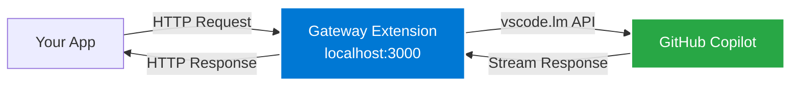

# GitHub Copilot AI Gateway

Expose GitHub Copilot's AI models as a local HTTP server with OpenAI-compatible endpoints.

## Why

Access powerful AI models (Claude 3.5 Sonnet, GPT-4o, o1) from any application—Python scripts, CLI tools, web apps—without additional API keys or billing.

## How It Works



**The gateway runs inside VS Code** and translates OpenAI-compatible requests to VS Code's Language Model API.

> **⚠️ VS Code must be running** with the extension enabled for the gateway to work.

## Quick Start

**1. Build & Install**
```bash
./build.sh        # macOS/Linux
build.bat         # Windows
```

**2. Open VS Code**  
Extension auto-starts. Check status bar (bottom-right): `✓ AI Gateway :3000 (hosting)`

**3. Get Your API Key**  
Click the status bar → "Copy API Key" → Paste into your environment:
```bash
export GHCGTW_API_KEY='your-api-key-here'
```

**4. Use It**
```bash
pip install -r requirements.txt
python qchat.py "Explain async/await in Python"
```

Done! Any app can now call `http://localhost:3000/v1/chat/completions`

## Security

- **Localhost-only**: Gateway only accepts connections from `127.0.0.1` (not accessible from network)
- **API Key**: Every request (except `/health`) requires `Authorization: Bearer <API_KEY>` header
- **Browser protection**: Blocks requests with `Origin` or `Referer` headers (CSRF prevention)
- **Key storage**: API key auto-generated on first run, stored encrypted in OS keychain
- **Key management**: 
  - View: Click status bar → shows key in popup
  - Copy: Click "Copy API Key" button
  - Regenerate: Command palette → "GitHub Copilot Gateway: Regenerate API Key"

> **Note:** The same API key is shared across all VS Code windows for the same user.

## API Endpoints

| Endpoint | Method | Description |
|----------|--------|-------------|
| `/v1/models` | GET | List available models |
| `/v1/chat/completions` | POST | Chat with streaming, function/tool calling, vision (images) |
| `/v1/tokens` | POST | Count tokens for messages |
| `/health` | GET | Server status |

**Supported Features:**
- ✅ Streaming responses (SSE)
- ✅ Function/tool calling
- ✅ Vision (image input via base64 data URIs)
- ✅ Multiple models (GPT-4o, Claude 3.5 Sonnet, o1, etc.)

OpenAI SDK compatible—just point `base_url` to `http://localhost:3000/v1`

## Example Usage

**Python:**
```python
import openai
import os

client = openai.OpenAI(
    base_url="http://localhost:3000/v1",
    api_key=os.environ.get('GHCGTW_API_KEY')
)
response = client.chat.completions.create(
    model="gpt-4o",
    messages=[{"role": "user", "content": "Hello!"}],
    stream=True
)
for chunk in response:
    print(chunk.choices[0].delta.content, end="")
```

**cURL:**
```bash
curl http://localhost:3000/v1/chat/completions \
  -H "Content-Type: application/json" \
  -H "Authorization: Bearer $GHCGTW_API_KEY" \
  -d '{"model": "gpt-4o-mini", "messages": [{"role": "user", "content": "Hi!"}]}'
```

## Requirements

- GitHub Copilot subscription
- VS Code with Copilot extension (installed & authenticated)
- VS Code must be running for gateway to work

## Compliance

Uses official VS Code Language Model API (`vscode.lm`) as documented in [Microsoft's Copilot Extensibility docs](https://code.visualstudio.com/docs/copilot/copilot-extensibility-overview). No terms violations. For personal/local development use.

## Troubleshooting

| Issue | Fix |
|-------|-----|
| Connection refused | VS Code must be running. Check status bar: `✓ AI Gateway :3000 (hosting)` |
| Unauthorized error | Set API key: `export GHCGTW_API_KEY='key'`. Get key from status bar popup. |
| Port in use | Only one VS Code instance can host. Non-hosting windows show hollow circle `○`. |
| No models | Sign in to GitHub Copilot extension |
