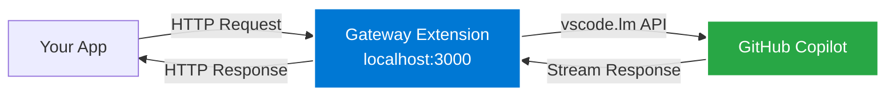

# GitHub Copilot AI Gateway

Expose GitHub Copilot's AI models as a local HTTP server with OpenAI- and Anthropic-compatible endpoints.

## Intended Use

This project is provided **for local experimentation and learning** on your own machine (or your own VM on the same host) and is **not** intended to be run for other users, teams, external clients, or as a hosted/shared service. It is not affiliated with or endorsed by Microsoft or GitHub. You are solely responsible for your use, including ensuring it complies with all applicable terms and policies (for example: GitHub Copilot terms, Visual Studio Code license and Marketplace terms, your organization’s policies, and any third‑party client terms). Model availability, entitlements, and usage limits still depend on your Copilot plan and organization settings. This software is provided “AS IS”, without warranties of any kind, and this documentation is not legal advice; if you are unsure whether your intended use is permitted, review the applicable terms and consult your organization or qualified counsel.

## Why

Experiment with OpenAI-compatible / Anthropic-compatible clients against the models available through **your existing GitHub Copilot in VS Code**.

## How It Works



**The gateway runs inside VS Code** and translates OpenAI- and Anthropic-compatible requests to VS Code's Language Model API.

> **⚠️ VS Code must be running** with the extension enabled for the gateway to work.

## Quick Start

**1. Build & Install**
```bash
./build.sh        # macOS/Linux
build.bat         # Windows
```

**2. Open VS Code**  
Extension auto-starts. Check status bar (bottom-right): `AI Gateway :3000 [model]`

**3. Get Your API Key**  
Click the status bar → "Copy API Key" → Paste into your environment:
```bash
export GHCGTW_API_KEY='your-api-key-here'
```

**4. Try It**
```bash
# Quick test with curl (replace YOUR-API-KEY)
curl http://localhost:3000/v1/chat/completions \
  -H "Content-Type: application/json" \
  -H "Authorization: Bearer YOUR-API-KEY" \
  -d '{"model": "gpt-5-mini", "messages": [{"role": "user", "content": "Hi!"}]}'

# Or use the Python CLI
pip install -r requirements.txt
./qchat.py "Explain async/await in Python"
```

## Settings

| Setting | Default | Description |
|---------|---------|-------------|
| `ghcgtw.port` | `3000` | Port for the gateway server |
| `ghcgtw.defaultModel` | `gpt-5-mini` | Default model when client doesn't specify one |
| `ghcgtw.secondaryBindAddress` | (empty) | Additional IP to bind to (for VMs). See [OpenClaw/Clawdbot Setup](README.moltbot.md) |

Settings auto-apply — no restart required.

## Security

- **Localhost by default**: Gateway binds to `127.0.0.1` only
- **Secondary address**: Optional binding to a private IP (for VMs). Public IPs are blocked.
- **API Key**: Every request (except `/health`) requires `Authorization: Bearer <KEY>` or `X-Api-Key: <KEY>`
- **Browser protection**: Blocks requests with `Origin` or `Referer` headers
- **Key storage**: Auto-generated, stored encrypted in OS keychain

> **Note:** The same API key is shared across all VS Code windows for the same user.

## API Endpoints

| Endpoint | Method | Format | Description |
|----------|--------|--------|-------------|
| `/v1/messages` | POST | Anthropic | Chat completions (for Claude Code) |
| `/v1/chat/completions` | POST | OpenAI | Chat completions (for Crush, aider, etc.) |
| `/v1/models` | GET | OpenAI | List available models |
| `/v1/tokens` | POST | Custom | Count tokens for messages |
| `/health` | GET | Custom | Server status |

**Supported Features:**
- ✅ Streaming responses (SSE)
- ✅ Multiple models (GPT-4o, Claude 3.5 Sonnet, o1, etc.)
- ✅ Token counting (`/v1/tokens`)

**Not Supported (vscode.lm limitations):**
- ❌ Function/tool calling (not wired to Copilot)
- ❌ Vision/image input (not exposed via API)
- ❌ Token usage in responses (only pre-request counting)
- ❌ Embeddings

## Behavior

### Authentication
All clients use the **same API key** (get it from the status bar popup).

| Header | Format |
|--------|--------|
| `Authorization: Bearer <KEY>` | Standard (OpenAI SDK, Claude Code) |
| `X-Api-Key: <KEY>` | Alternative (some Anthropic clients) |

### Model Selection
1. **Client specifies model AND it exists** → Use that model
2. **Client specifies model but NOT found** → Use gateway default
3. **Client doesn't specify model** → Use gateway default

Claude Code and Crush will use whatever model you configure in the Gateway settings (e.g., `claude-sonnet-4`), regardless of what model name they send.

## Client Configuration

### Claude Code

Claude Code uses the Anthropic Messages API format (`/v1/messages`). We use "Foundry mode" to point Claude Code at a custom base URL (this local gateway) instead of the default Anthropic endpoint.

> **Note:** Claude Code and other tools have their own terms and policies. Ensure your configuration and usage complies with those terms.

**Option 1: Settings File (recommended)**

Create or edit `~/.claude/settings.json`:
```json
{
  "env": {
    "CLAUDE_CODE_USE_FOUNDRY": "1",
    "ANTHROPIC_FOUNDRY_BASE_URL": "http://localhost:3000/anthropic/",
    "ANTHROPIC_FOUNDRY_API_KEY": "your-gateway-api-key",
    "ANTHROPIC_DEFAULT_SONNET_MODEL": "claude-sonnet-4.5",
    "ANTHROPIC_DEFAULT_HAIKU_MODEL": "claude-haiku-4.5",
    "ANTHROPIC_DEFAULT_OPUS_MODEL": "claude-opus-4.5"
  }
}
```

**Option 2: Environment Variables**
```bash
export CLAUDE_CODE_USE_FOUNDRY=1
export ANTHROPIC_FOUNDRY_BASE_URL=http://localhost:3000/anthropic/
export ANTHROPIC_FOUNDRY_API_KEY=your-gateway-api-key
export ANTHROPIC_DEFAULT_SONNET_MODEL=claude-sonnet-4-5
export ANTHROPIC_DEFAULT_HAIKU_MODEL=claude-haiku-4-5
export ANTHROPIC_DEFAULT_OPUS_MODEL=claude-opus-4-5
```

**Verify it works:**
```bash
claude "Say hello"
```

> **Note:** `CLAUDE_CODE_USE_FOUNDRY=1` routes Claude Code to a custom base URL. The gateway exposes `/anthropic/v1/messages` to match what Foundry mode expects. Requests are served via VS Code's `vscode.lm` API and the models available to your Copilot subscription.

---

### Crush

[Crush](https://github.com/charmbracelet/crush) is a terminal-based AI coding assistant from Charm. It supports custom providers.

Create or edit `~/.config/crush/crush.json`:
```json
{
  "$schema": "https://charm.land/crush.json",
  "providers": {
    "copilot-gateway": {
      "name": "GHCGTW - Copilot Gateway",
      "type": "anthropic",
      "base_url": "http://localhost:3000",
      "api_key": "$GHCGTW_API_KEY",
      "models": [
        {
          "id": "claude-opus-4.5",
          "name": "GHCGTW - Claude Opus 4.5",
          "context_window": 200000,
          "default_max_tokens": 16000
        },
        {
          "id": "claude-sonnet-4.5",
          "name": "GHCGTW - Claude Sonnet 4.5",
          "context_window": 200000,
          "default_max_tokens": 16000
        },
        {
          "id": "gpt-5",
          "name": "GHCGTW - GPT 5",
          "context_window": 128000,
          "default_max_tokens": 16000
        },
        {
          "id": "gpt-5-mini",
          "name": "GHCGTW - GPT 5 Mini",
          "context_window": 128000,
          "default_max_tokens": 16000
        }
      ]
    }
  }
}
```

> **Note:** The model ID must match an available Copilot model (e.g., `claude-opus-4.5`, `gpt-5-mini`). The gateway will return an error if the requested model doesn't exist. You can also use `type: "openai-compat"` with `base_url: "http://localhost:3000/v1"` if preferred.

Set your API key (get it from VS Code status bar → AI Gateway → Copy API Key):
```bash
# Temporary (current session only)
export GHCGTW_API_KEY=your-gateway-api-key

# Persistent (add to shell config)
echo 'export GHCGTW_API_KEY="your-gateway-api-key"' >> ~/.zshrc && source ~/.zshrc
```

**Verify it works:**
```bash
crush
# Press Ctrl+O to select "Copilot Gateway" as your provider
```

---

### OpenClaw / Clawdbot

[OpenClaw](https://github.com/openclaw/openclaw) (formerly Moltbot/Clawdbot) is a personal AI assistant that runs on your own devices and connects to messaging platforms (WhatsApp, Telegram, Slack, Discord, etc.). It supports custom model providers, making it fully compatible with this gateway.

**Prerequisites:**
- Node.js ≥22
- OpenClaw installed: `npm install -g openclaw@latest` (or `clawdbot@latest`)

**Configuration:**

Create or edit `~/.openclaw/openclaw.json` (or `~/.clawdbot/clawdbot.json`):
```jsonc
{
  "models": {
    "mode": "replace",
    "providers": {
      "ghcgtw": {
        "baseUrl": "http://localhost:3000/v1",
        "apiKey": "YOUR_API_KEY_HERE",
        "api": "openai-completions",
        "authHeader": true,
        "headers": {
          "X-Api-Key": "YOUR_API_KEY_HERE"
        },
        "models": [
          {
            "id": "gpt-5-mini",
            "name": "GPT-5 Mini (via Gateway)",
            "reasoning": false,
            "input": ["text"],
            "cost": { "input": 0, "output": 0, "cacheRead": 0, "cacheWrite": 0 },
            "contextWindow": 128000,
            "maxTokens": 16384
          }
        ]
      }
    }
  },
  "agents": {
    "defaults": {
      "model": {
        "primary": "ghcgtw/gpt-5-mini"
      },
      "models": {
        "ghcgtw/gpt-5-mini": { "alias": "gpt5" }
      }
    }
  },
  "gateway": {
    "mode": "local"
  }
}
```

> **⚠️ Important:** Replace `YOUR_API_KEY_HERE` in **both places** (the `apiKey` field AND inside `headers.X-Api-Key`). Get the key from VS Code status bar → AI Gateway → Copy API Key.

> **Note:** Use `"api": "openai-completions"` (recommended) or `"api": "anthropic-messages"`. The gateway supports both formats. The `baseUrl` must include `/v1`.

**Test it:**
```bash
openclaw doctor           # or: clawdbot doctor
openclaw agent --agent main --message "What model are you?"
```

> **⚠️ Note:** You must specify `--agent main` (or `-a main`). Running just `openclaw agent -m "..."` will fail with a session selection error.

> **For VMs:** If running OpenClaw/Clawdbot in a VM, see [README.moltbot.md](README.moltbot.md) for detailed setup.

---

### Other Clients

Any OpenAI-compatible or Anthropic-compatible client can use this gateway.

**OpenAI SDK (Python):**
```python
import openai
import os

client = openai.OpenAI(
    base_url="http://localhost:3000/v1",
    api_key=os.environ.get('GHCGTW_API_KEY')
)

response = client.chat.completions.create(
    model="gpt-4o",
    messages=[{"role": "user", "content": "Hello!"}],
    stream=True
)

for chunk in response:
    if chunk.choices[0].delta.content:
        print(chunk.choices[0].delta.content, end="")
```

**aider:**
```bash
export OPENAI_API_BASE=http://localhost:3000/v1
export OPENAI_API_KEY=$GHCGTW_API_KEY
aider --model gpt-4o
```

**cURL:**
```bash
# OpenAI format
curl http://localhost:3000/v1/chat/completions \
  -H "Content-Type: application/json" \
  -H "Authorization: Bearer $GHCGTW_API_KEY" \
  -d '{"model": "gpt-4o", "messages": [{"role": "user", "content": "Hi!"}]}'

# Anthropic format
curl http://localhost:3000/v1/messages \
  -H "Content-Type: application/json" \
  -H "X-Api-Key: $GHCGTW_API_KEY" \
  -H "anthropic-version: 2023-06-01" \
  -d '{"model": "claude-sonnet-4", "max_tokens": 1024, "messages": [{"role": "user", "content": "Hi!"}]}'
```

## Requirements

- GitHub Copilot subscription
- VS Code with Copilot extension (installed & authenticated)
- VS Code must be running for gateway to work

## For AI Agents: Integration Spec

> Copy this section into your project's CLAUDE.md or AGENTS.md to enable AI integration.

**Base URL:** `http://localhost:3000`

**Authentication:** `Authorization: Bearer <KEY>` or `X-Api-Key: <KEY>` (from env `GHCGTW_API_KEY`)

**Endpoints:**

| Endpoint | Format | Spec |
|----------|--------|------|
| `POST /v1/chat/completions` | OpenAI Chat Completions API | Streaming (SSE) and non-streaming |
| `POST /v1/messages` | Anthropic Messages API | Streaming (SSE) and non-streaming |
| `GET /v1/models` | OpenAI Models API | List available models |
| `GET /health` | — | No auth required |

**Behavior:**
- Model field is optional; gateway uses its configured default if omitted or not found
- Streaming recommended for responsive UX

**Not Supported:**
- Function/tool calling
- Vision/image input
- Token usage in responses

---

## Compliance

This extension uses the official VS Code Language Model API (`vscode.lm`) as documented in [Microsoft's Copilot Extensibility docs](https://code.visualstudio.com/docs/copilot/copilot-extensibility-overview).

- This repository does **not** grant you additional rights to use GitHub Copilot or any model.
- Make sure your usage (including any third-party client you connect) complies with GitHub Copilot terms, VS Code license/Marketplace terms, and your organization’s policies.
- Do not expose the gateway publicly or operate it as a shared/hosted service.

## Troubleshooting

| Issue | Fix |
|-------|-----|
| Connection refused | VS Code must be running. Check status bar shows `AI Gateway :3000 [model]`. |
| Unauthorized error | Set API key: `export GHCGTW_API_KEY='key'`. Get key from status bar popup. |
| Port in use | Only one VS Code instance can host. Non-hosting windows show `AI Gateway :3000` (without model). |
| No models | Sign in to GitHub Copilot extension |

## Authors

- Matej Ciesko
- Christopher Earley
