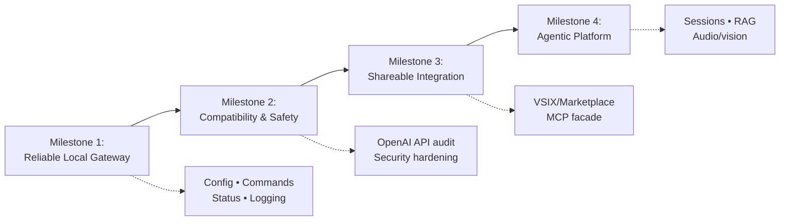

# GitHub Copilot Gateway - TODO

## 🗺️ Roadmap (High-Level Milestones)

Each milestone maps to sections below; the checklist remains the source of truth.

## ⚠️ Non-Goals / API Limitations (Important)
- GitHub Copilot UI usage metrics ("chat messages", "premium stats", "agent sessions") are not exposed via the VS Code extension API today, so the gateway cannot re-expose them.
- True post-request token usage is not available from `vscode.lm` responses today; only pre-request token counting via `model.countTokens(...)` is available.
- A standalone gateway process (outside VS Code) cannot use `vscode.lm` directly; a standalone CLI would require a different provider/backend.

## 🚧 Top Priority: Shareable Integration Artifact
- [ ] Create a “prototype integration kit” with a deliberate dual-surface design: (1) keep the OpenAI-compatible REST API on `http://127.0.0.1:3000/v1` for drop-in client compatibility, and (2) add an MCP server facade (stdio or streamable HTTP) for AI hosts/agents—so they can discover available tools/resources (schemas + metadata) and invoke them in a standard way

Immediate thoughts: for most teams the best artifact is an installable VSIX (or Marketplace install once published) plus a short “Quickstart for agents” section that documents the REST base URL and what is/ isn’t supported. Sharing only source code is usually too much friction for prototyping (build/install drift). For “Copilot agent / tool-native” integrations, MCP is the right complementary surface: it’s not just a separate “metadata endpoint”—the MCP protocol itself provides discovery (available tools, schemas, server info) and a standard invocation mechanism. To avoid drift between REST behavior, MCP tool schemas, and docs: make the gateway’s capabilities the single source of truth and generate/serve both surfaces dynamically from runtime introspection (e.g., tool list + JSON schemas from `vscode.lm.tools`, model list + capabilities from `vscode.lm.selectChatModels()`, and shared request/response types in one place).

## 🔥 Immediate Priority (High Value, Low Effort)

### Expose VS Code's Tool Registry
- [ ] Explore `vscode.lm.tools` to discover what built-in tools are registered
- [ ] Add `/v1/tools` endpoint to list available tools (name, description, inputSchema)
- [ ] Implement tool invocation via `vscode.lm.invokeTool(name, options, token)`
- [ ] Map tool results to OpenAI-style tool response format
- [ ] Test with Copilot's built-in tools (workspace search, file operations, etc.)
- [ ] Document which tools are available and their capabilities
- [ ] Add examples showing how to use registered tools from clients

### Real-World Validation Testing
- [ ] Test gateway with Claude 3.5 Sonnet model (if available in Copilot subscription)
- [ ] Test gateway with Gemini models (if available)
- [ ] Test tool calling with different model families (OpenAI vs Anthropic vs Google)
- [ ] Verify vision/image input works across model providers
- [ ] Document which models are actually available in GitHub Copilot subscription
- [ ] Test edge cases in model selection logic (typos, family matching, vendor fallback)
- [ ] Create test script to validate all endpoints with different models

### Configuration & Port Flexibility
- [ ] Add VS Code configuration settings in package.json:
  - [ ] `ghcgtw.port` - configurable port (default: 3000)
  - [ ] `ghcgtw.defaultModel` - default model to use (default: gpt-4o-mini)
  - [ ] `ghcgtw.autoStart` - auto-start server on activation (default: true)
  - [ ] `ghcgtw.enableLogging` - enable output channel logging (default: true)
- [ ] Read configuration in extension.ts activation
- [ ] Add VS Code commands:
  - [ ] `ghcgtw.startServer` - Start the HTTP server
  - [ ] `ghcgtw.stopServer` - Stop the HTTP server
  - [ ] `ghcgtw.restartServer` - Restart the HTTP server
  - [ ] `ghcgtw.showStatus` - Show current server status
- [ ] Add status bar item showing:
  - [ ] Server running state (🟢/🔴)
  - [ ] Current port number
  - [ ] Click to show commands
- [ ] Handle port-in-use errors gracefully (try next port or show error)

### Marketplace Publication
- [ ] Create publisher account on VS Code Marketplace (if not exists)
- [ ] Add marketplace metadata to package.json:
  - [ ] Categories (e.g., "AI", "Other")
  - [ ] Keywords (e.g., "github-copilot", "openai", "api", "proxy", "gateway")
  - [ ] Icon (128x128 PNG)
  - [ ] Gallery banner color
  - [ ] Detailed description
- [ ] Create screenshots/animated GIFs:
  - [ ] Server running in status bar
  - [ ] Example curl/HTTP request
  - [ ] Python client example
- [ ] Add CHANGELOG.md for version tracking
- [ ] Review and update README with:
  - [ ] Installation from marketplace
  - [ ] Configuration instructions
  - [ ] Known limitations
- [ ] Test installation from VSIX one more time
- [ ] Publish v0.1.0 as preview/beta version
- [ ] Monitor initial user feedback

---

## 📋 Short-Term Enhancements (Medium Effort, High Impact)

### Error Handling & Observability
- [ ] Create VS Code Output Channel for logging
- [ ] Log all incoming requests with timestamps
- [ ] Log all responses with status codes
- [ ] Log model selection decisions (which model was chosen and why)
- [ ] Improve error messages to match OpenAI error format:
  - [ ] Model not found errors
  - [ ] Rate limit errors
  - [ ] Token limit exceeded errors
  - [ ] Invalid request format errors
- [ ] Add request/response size logging
- [ ] Add timing metrics (request duration)
- [ ] Handle malformed JSON gracefully
- [ ] Add debug mode configuration for verbose logging

### OpenAI API Compatibility Audit
- [ ] Document all supported OpenAI parameters in README
- [ ] Document unsupported/ignored parameters
- [ ] Add support for chat completion parameters:
  - [ ] `temperature` - map to vscode.lm if supported
  - [ ] `max_tokens` - map to vscode.lm if supported
  - [ ] `top_p` - map or document as ignored
  - [ ] `frequency_penalty` - document as ignored
  - [ ] `presence_penalty` - document as ignored
  - [ ] `stop` sequences - investigate vscode.lm support
  - [ ] `n` (multiple completions) - document as unsupported
  - [ ] `user` field - pass through if applicable
- [ ] Test with popular OpenAI client libraries:
  - [ ] Official OpenAI Python SDK
  - [ ] LangChain with OpenAI provider
  - [ ] Node.js openai package
- [ ] Add parameter validation and helpful errors
- [ ] Document behavior differences from OpenAI API

### Security Hardening
- [ ] Add optional API key authentication:
  - [ ] Configuration setting `ghcgtw.apiKey`
  - [ ] Validate `Authorization: Bearer <key>` header
  - [ ] Return 401 for invalid/missing keys
- [ ] Add CORS headers for browser-based clients
- [ ] Add configuration `ghcgtw.allowedOrigins` for CORS
- [ ] Add configuration `ghcgtw.localhostOnly` (default: true)
- [ ] Reject non-localhost connections when `localhostOnly` is true
- [ ] Add rate limiting per client/IP (optional)
- [ ] Document security considerations in README:
  - [ ] Why localhost-only is recommended
  - [ ] How to secure in multi-user environments
  - [ ] API key best practices

---

## 🚀 Medium-Term Features (Higher Effort)

### Response Format Support
- [ ] Detect `response_format` parameter in request
- [ ] Handle `response_format: { "type": "json_object" }`:
  - [ ] Add system message instructing JSON output
  - [ ] Test with different models
- [ ] Validate response is valid JSON when JSON mode requested
- [ ] Add error handling for invalid JSON responses
- [ ] Document JSON mode support per model family
- [ ] Test with structured output use cases

### Enhanced Tool Calling
- [ ] Test parallel function calling (multiple tools in one request)
- [ ] Verify tool choice modes work correctly:
  - [ ] `auto` - model decides
  - [ ] `required` - force tool call
  - [ ] `none` - disable tools
  - [ ] `{"type": "function", "function": {"name": "..."}}` - specific tool
- [ ] Handle tool execution errors gracefully
- [ ] Add timeout configuration for tool calls
- [ ] Test nested/recursive tool calling scenarios
- [ ] Add examples to README:
  - [ ] Simple tool calling example
  - [ ] Multi-tool workflow
  - [ ] Error handling patterns
- [ ] Document which models support tools

### Model Capabilities Discovery
- [ ] Implement `/v1/models/{model_id}` endpoint
- [ ] Return detailed model information:
  - [ ] `id`, `vendor`, `family`
  - [ ] `capabilities`: `{"vision": bool, "tools": bool, "json_mode": bool}`
  - [ ] `max_input_tokens`, `max_output_tokens`
  - [ ] `context_window` size
- [ ] Introspect vscode.lm API for capability detection
- [ ] Filter/warn when using unsupported features:
  - [ ] Tools with models that don't support them
  - [ ] Images with text-only models
- [ ] Cache model capabilities for performance
- [ ] Add `/v1/models` filtering by capability

---

## 🤖 Agentic Mode + Memory/RAG + Media (Next-Level)

### Agent Runtime (Copilot “Agent Mode” Outside VS Code)
- [ ] Define a minimal “agent loop” contract (plan → act/tool → observe → continue) that runs over existing `/v1/chat/completions`
- [ ] Add server-side “session” concept to support multi-turn agent runs:
  - [ ] Create/attach session id (header or request field)
  - [ ] Persist message/tool history per session
  - [ ] Add TTL + max history size to avoid unbounded growth
- [ ] Add endpoints for agent operations (in addition to OpenAI-compatible endpoints):
  - [ ] `POST /v1/agents/runs` (start an agent run)
  - [ ] `GET /v1/agents/runs/{id}` (poll status)
  - [ ] `GET /v1/agents/runs/{id}/events` (stream events)
  - [ ] `POST /v1/agents/runs/{id}/cancel`
- [ ] Define a stable “agent event” stream schema (status, tool-call, tool-result, thoughts/plan redacted, errors)
- [ ] Add deterministic “tool budget” and “step limit” controls (max tool calls, max iterations, max tokens)

### Memory Management (Short-Term, Long-Term, and Summaries)
- [ ] Add a memory store abstraction:
  - [ ] In-memory store (baseline)
  - [ ] Local persistent store (SQLite or file-based JSONL)
  - [ ] Configurable storage location (per-workspace + global)
- [ ] Implement “conversation summarization” checkpoints:
  - [ ] Summarize every N turns or when token budget tight
  - [ ] Keep raw turns for a short window, summaries for long window
- [ ] Add memory controls to API:
  - [ ] `POST /v1/memory/append` (store a fact)
  - [ ] `POST /v1/memory/query` (retrieve relevant facts)
  - [ ] `POST /v1/memory/forget` (delete entries by id/query)
  - [ ] `GET /v1/memory/stats`
- [ ] Add privacy controls:
  - [ ] Allowlist/denylist paths for ingestion
  - [ ] Secret scanning/redaction before storing memory
  - [ ] Per-tool permission prompts (optional)

### Local RAG (Repo-Aware Retrieval) to Power Agents
- [ ] Build a local index pipeline:
  - [ ] Workspace file chunking strategy
  - [ ] Metadata capture (path, git blame, last modified)
  - [ ] Incremental updates via file watchers
- [ ] Add retrieval endpoints/tools:
  - [ ] `POST /v1/retrieval/index` (build/refresh index)
  - [ ] `POST /v1/retrieval/query` (semantic + keyword hybrid)
  - [ ] `GET /v1/retrieval/status`
- [ ] Decide embeddings strategy:
  - [ ] Use embeddings endpoint if/when available
  - [ ] Fallback to local embeddings model (opt-in) OR lexical search only
- [ ] Add “grounding packets” to agent prompts (citations as file paths + ranges)
- [ ] Add safeguards: max retrieved tokens, dedupe, source ranking, ignore binary/large files

### Media: Images, Video, Desktop Sharing
- [ ] Improve image handling beyond “text note” conversion:
  - [ ] Accept `image_url` + base64 images reliably
  - [ ] Route images to `LanguageModelDataPart.image(...)` when supported
  - [ ] Capability-gate vision requests per model
- [ ] Add experimental “desktop snapshot” tool:
  - [ ] Capture screenshot on demand (with user confirmation)
  - [ ] Attach as image input part to the model
  - [ ] Redact sensitive regions (optional, later)
- [ ] Add video support as a staged pipeline:
  - [ ] Accept short clips or frame sampling
  - [ ] Convert to frames + audio track
  - [ ] Feed frames to vision model + transcript to text model

### Audio: Voice Input + Transcription (Copilot-style)
- [ ] Add an audio ingestion endpoint:
  - [ ] `POST /v1/audio/transcriptions` (OpenAI-style)
  - [ ] Support common formats (wav/m4a/mp3)
- [ ] Implement transcription backend options:
  - [ ] Use a Copilot/VS Code-provided transcription capability if available
  - [ ] Otherwise: local transcription engine (opt-in) with clear docs
- [ ] Add a “voice chat” helper mode for CLI:
  - [ ] Push-to-talk capture → transcribe → send to `/v1/chat/completions`
  - [ ] Stream assistant response back to terminal
- [ ] Add optional text-to-speech (TTS) endpoint/hook (opt-in)

### CLI/Python: First-Class Agent Workflows
- [ ] Extend `qchat.py` to support agent runs:
  - [ ] Start run, stream events, cancel run
  - [ ] Optional `--session` to reuse memory
- [ ] Add CLI commands for retrieval and memory:
  - [ ] `qchat index` / `qchat search` / `qchat remember` / `qchat forget`
- [ ] Add “scriptable mode” for CI-like automation:
  - [ ] JSON in/out (no interactive UI)
  - [ ] Exit codes based on agent success/failure

### API Extensions (Keeping Compatibility)
- [ ] Keep OpenAI-compatible endpoints stable; add new capabilities under `/v1/agents/*`, `/v1/memory/*`, `/v1/retrieval/*`, `/v1/audio/*`
- [ ] Add versioning for the extended APIs (`/v1beta/...` or response header)
- [ ] Add capability discovery so clients can detect supported features without trial-and-error

---

## 🔮 Long-Term Vision

### Embeddings Support
- [ ] Research if VS Code LM API supports embeddings
- [ ] Implement `/v1/embeddings` endpoint if supported
- [ ] Test with embedding models available in Copilot
- [ ] Document embedding use cases (RAG, semantic search)
- [ ] Add examples for vector database integration

### Multi-Instance Management
- [ ] Support multiple gateway instances on different ports
- [ ] Add per-workspace server configuration
- [ ] Show all running instances in status bar/commands
- [ ] Allow starting/stopping specific instances
- [ ] Persist instance configuration across VS Code restarts

### CLI Tool
- [ ] (Re-evaluate) Create standalone CLI for starting gateway without VS Code
- [ ] Package as npx-runnable tool
- [ ] Support same configuration options as extension
- [ ] Useful for CI/CD pipelines
- [ ] Document CLI usage patterns

### Advanced Features
- [ ] Streaming SSE improvements (better buffering, reconnection)
- [ ] Conversation history/context management
- [ ] (Gateway-only) Request/token estimates and reporting (based on `countTokens`, not Copilot quotas)
- [ ] Request/response caching layer
- [ ] (Gateway-only) Minimal metrics view (requests, errors, durations)
- [ ] WebSocket support for bidirectional communication

---

## 📝 Documentation & Quality

### Documentation Improvements
- [ ] Add architecture diagram to README (Mermaid already exists, enhance it)
- [ ] Create CONTRIBUTING.md for contributors
- [ ] Add troubleshooting section to README
- [ ] Document all configuration options with examples
- [ ] Add FAQ section
- [ ] Create example integration guides:
  - [ ] Using with LangChain
  - [ ] Using with Python OpenAI SDK
  - [ ] Using with curl/Postman
  - [ ] Using with web applications

### Testing & CI
- [ ] Add unit tests for extension logic
- [ ] Add integration tests for HTTP endpoints
- [ ] Add tests for model selection logic
- [ ] Set up GitHub Actions CI:
  - [ ] Run tests on push
  - [ ] Lint TypeScript code
  - [ ] Build VSIX on PRs
- [ ] Add code coverage reporting
- [ ] Test on Windows/Linux (currently macOS focused)

### Code Quality
- [ ] Add TypeScript strict mode
- [ ] Fix any linting warnings
- [ ] Add JSDoc comments to public functions
- [ ] Refactor large functions into smaller units
- [ ] Add error handling to all async operations
- [ ] Use proper TypeScript types (avoid `any`)

---

## ✅ Completed
- [x] Initial extension implementation
- [x] HTTP server on localhost:3000
- [x] OpenAI-compatible endpoints (/v1/chat/completions, /v1/models, /v1/tokens)
- [x] Streaming support (SSE)
- [x] Tool/function calling support
- [x] Vision/image input support (multimodal messages)
- [x] Token counting endpoint
- [x] Python CLI client (qchat.py)
- [x] Cross-platform build scripts (build.sh, build.bat)
- [x] README with usage instructions
- [x] ToS compliance documentation
- [x] First commit and GitHub push
- [x] Package metadata (publisher, repository)

---

**Next Recommended Actions (This Week):**
1. ✅ Configuration & Status Bar (items 2.1-2.4 above) - 3 hours
2. ✅ Real-World Model Testing (items 1.1-1.7 above) - 2 hours
3. ✅ Marketplace Publication prep (items 3.1-3.7 above) - 2 hours
